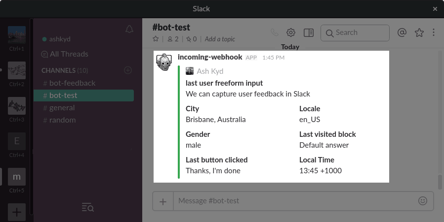

Chatfuel webhook sender
=======================

A JSON endpoint to send [Chatfuel](https://chatfuel.com/) user attributes to a Slack webhook.

Setup
=====
This app is intended for use in AWS Lambda. General setup:

1. Configure this app as an AWS Lambda
2. Set requisite env vars (see below)
3. Expose via a web gateway
4. Set up in Chatfuel as a JSON API card
  * Configure this as a POST endpoint
  * Sending through the Chatfuel vars and any custom vars you wish (see below)
  * Add a query param to the url to let the webhook know which channel to send to. Eg. `?slackChannel=test` where test corresponds to an environment variable below.

Environment variables
---------------------
The following variables may be configured:

Variable name | Description         
--------------|---------------------
SLACK_WEBHOOK_x | Full slack webhook url. Replace `x` with the channel name. Corresponds to slackChannel in the query params. [Generate a webhook from Slack](https://my.slack.com/services/new/incoming-webhook/)

Chatfuel variables
------------------
It is intended that you can throw any variables you like at this endpoint and
they will be printed accordingly. Some notes:

1. Send through all the default (blue) ChatFuel variables. These are used to
   format the user's name, profile pic etc. For a list, see [chatfuel.js](lib/chatfuel.js).
2. Send through any custom (blue) variables you wish to appear. If you don't
   send any, the hook will send the user's last entered text.

> ℹ Chatfuel can only send the user's last entered _text_ in the default answer
> block. If you wish to capture images, locations, or stickers you should use a
> _User input_ card.

Error messages
--------------

The following error messages may be printed in the logs:

Message            | Description         
-------------------|---------------------
no tasks specified | The query string must contain a task to run, eg. `?slackChannel=x`
webhook not configured | The designated webhook needs to be configured via environment variable.
error sending      | An error occurred while sending the webhook. Is the hook valid?
